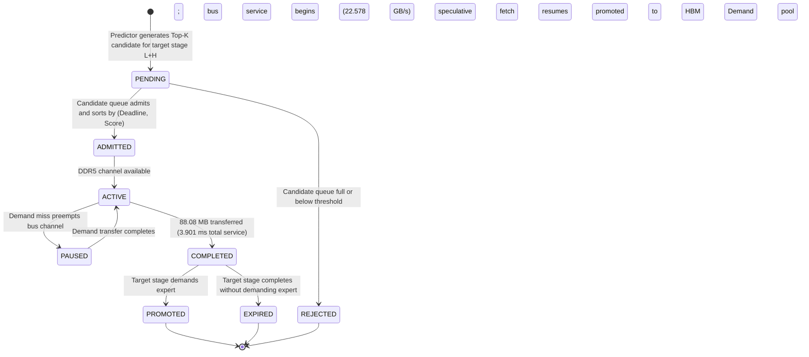

# DDR5 Transfer Engine & Prefetch Candidate Lifecycle

```mermaid
stateDiagram-v2
    [*] --> PENDING: Predictor generates Top-K candidate for target stage L+H
    PENDING --> ADMITTED: Candidate queue admits and sorts by (Deadline, Score)
    PENDING --> REJECTED: Candidate queue full or below threshold
    ADMITTED --> ACTIVE: DDR5 channel available; bus service begins (22.578 GB/s)
    ACTIVE --> PAUSED: Demand miss preempts bus channel
    PAUSED --> ACTIVE: Demand transfer completes; speculative fetch resumes
    ACTIVE --> COMPLETED: 88.08 MB transferred (3.901 ms total service)
    COMPLETED --> PROMOTED: Target stage demands expert; promoted to HBM Demand pool
    COMPLETED --> EXPIRED: Target stage completes without demanding expert
    PROMOTED --> [*]
    EXPIRED --> [*]
    REJECTED --> [*]
```
